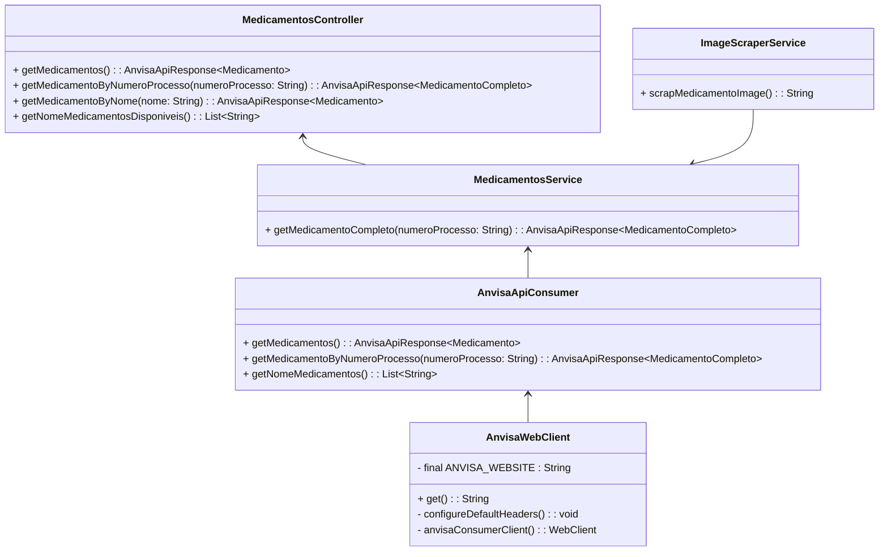

# API Medicamentos Bulário

<div align="center">
  
  
  <br>*Consulta ao medicamento AAS retornando imagem*
</div>

## 📝 Sobre o projeto

* Projeto pessoal;
* Realiza consultas à API de bulário da ANVISA, retornando informações sobre medicamentos incluindo uma imagem em formato base 64;
* Por se tratar de uma API que retorna imagens há também um visualizador de respostas da API feito em JavaScript Vanilla;
  * Esse visualizador pode ser encontrado no diretório `src/main/java/resources/templates/visualizer/`.
* Ao clonar o projeto é necessário fazer o download do driver do navegador Google Chrome (chromedriver) e adicioná-lo ao diretório `src/main/java/resources/static/`;
  * Verifique a versão do Google Chrome instalado em sua máquina acessando `chrome://version`;
  * Procure pelo chromedriver compatível com sua versão do Google Chrome em [Chrome for Testing availability](https://googlechromelabs.github.io/chrome-for-testing/).
* É necessário que o Google Chrome esteja no diretório `C:\Program Files\Google\Chrome\Application\` para que o chromedriver encontre-o automaticamente;
* <strong>Tecnologias usadas na API</strong>: `☕ Java 19`, `🍃 Spring Boot`, `✅ Selenium`;
* <strong>Tecnologias usadas no visualizador</strong>: `🟪 Bootstrap`, `🟨 JavaScript`.

> [!IMPORTANT]
> A extração das imagens é feita utilizando Selenium, capturando o base 64 da primeira imagem retornada em uma busca no Google Imagens. Por essa razão, podem haver diferenças entre o medicamento consultado e a imagem retornada.



### Endpoints
`/medicamentos` - Retorna uma página contendo a lista dos medicamentos simples em ordem alfabética;<br>
`/medicamentos/<NOME DO MEDICAMENTO>/` - Retorna uma página contendo a lista de medicamentos simples com o mesmo nome porém de diferentes empresas farmacêuticas;<br>
`/medicamentos/disponiveis/<NOME DO MEDICAMENTO>/` - Retorna uma lista de strings contendo o nome dos medicamentos disponíveis para consulta.
### Query Params
`/medicamentos/?numeroProcesso=<NUMERO DO PROCESSO DO MEDICAMENTO>` - Retorna uma página contendo a lista com um medicamento completo incluindo a imagem no formato base 64 do medicamento;<br>
`*/?size=<QUANTIDADE DE MEDICAMENTOS>` - Limita quantidade de medicamentos retornados por consulta (por padrão 10 medicamentos são retornados);<br>
`*/?page=<NUMERO DA PAGINA>` - Configura o número da página que será retornada na consulta;<br>

> [!TIP]
> Por se tratar de uma API de consultas todos endpoints aceitam apenas métodos HTTP GET.

## Exemplo de retorno
### Medicamento simples
```javascript
{
  "idMedicamento": "1031",
  "numeroProcessoMedicamento": "2599202296475",
  "nomeMedicamento": "ADENON",
  "nomeEmpresaFarmaceutica": "WELEDA DO BRASIL LABORATÓRIO E FARMÁCIA LTDA",
  "dataAtualizacao": "2024-07-23T18:00:05.000-0300",
  "idBulaPaciente": ""
}
```
### Medicamento completo
```javascript
{
  "medicamento": {
    "fotoMedicamentoBase64": "",
    "idMedicamento": "1031",
    "nomeMedicamento": "ADENON",
    "numeroRegistro": "100610007",
    "categoria": {
      "codigo": "2",
      "descricao": "Dinamizado"
    },
    "dataRegistro": "1976-04-07T00:00:00.000-0300",
    "dataVencimentoRegistro": "2026-04-01T00:00:00.000-0300",
    "principioAtivo": "BARYTA CARBONICA, BERBERIS VULGARIS L., CALCAREA CARBONICA, MERCURIUS SULPHURATUS RUBER",
    "situacao": "Válido",
    "idBulaPaciente": "",
    "numeroProcesso": "2599202296475"
  },
  "empresaFarmaceutica": {
    "razaoSocial": "WELEDA DO BRASIL LABORATÓRIO E FARMÁCIA LTDA",
    "cnpj": "56992217000180"
  }
}
```
